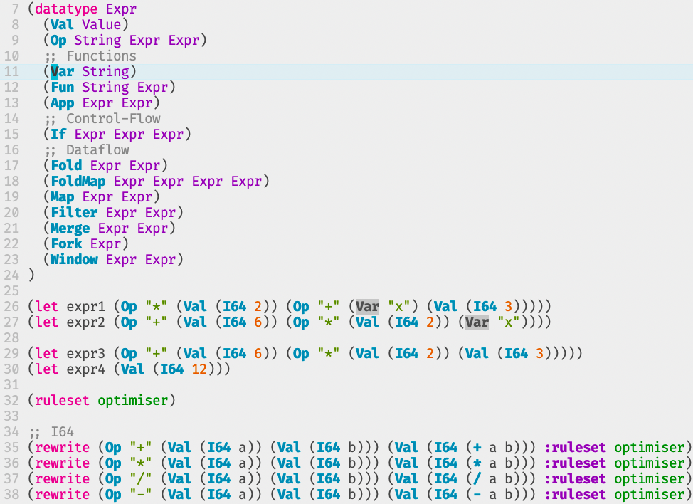

A tree-sitter parser for [egg](https://github.com/egraphs-good/egglog).

Currently supports:
* Syntax highlighting
* References



# Installation

Using [lazy.nvim](https://github.com/folke/lazy.nvim):

```lua
{
  'segeljakt/tree-sitter-egg'
}
```
